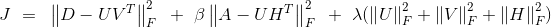

# Shared Matrix Factorization

This repository contains a simple implementation of a shared matrix factorization.
Two matricies D and A are factorized with a shared factor U so that
D &#x2248; U*V'  and A &#x2248; U*H'.  

The corresponding optimization problem looks as follows:  
Minimize U, V, H   

Where the last term is added for regularization and *F* is the Frobenius norm.  

An SGD based update rule is used to iterativly compute the solution.
